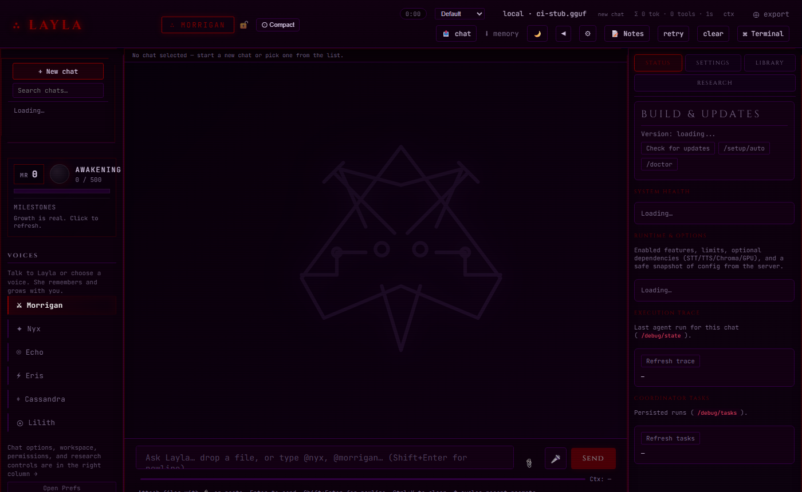
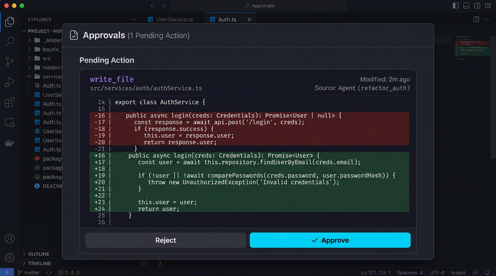
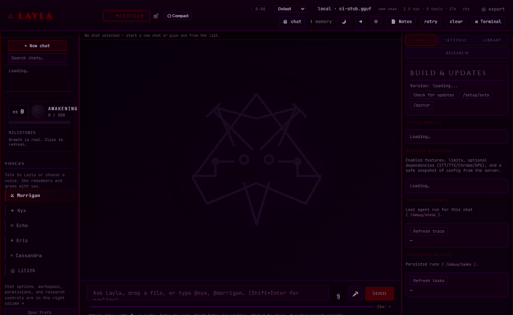

<div align="center">

# Layla

**Your own AI. On your machine. No cloud. No leash.**

[](https://github.com/PapaKoftes/Layla/actions/workflows/ci.yml)

[](LICENSE)

<br/>



<sub>Illustrative UI preview. Record a real session → <a href="docs/media/README.md">docs/media/README.md</a></sub>

<br/>

**Local-first · Tool-heavy · Approval-gated · Six aspects · Voice & browser optional**

[Install](#install) · [Screenshots](#screenshots--demo) · [Features](#what-she-can-do) · [Docs](#documentation) · [Contributing](CONTRIBUTING.md)

</div>

---

Layla is a **local-first AI companion and engineering agent**. She runs on your hardware with any GGUF model you choose — no API keys or subscriptions required for core use. She remembers, studies, exposes a large native tool surface, can browse the web, and supports voice I/O.

**Positioning:** Layla is an open, self-hosted **agent platform** (HTTP API + Web UI + optional MCP), not a drop-in clone of a single vendor product — quality depends on your model, hardware, and config.

**Why Layla exists:** A sovereign alternative to corporate AI — privacy-focused, local-first, anti-surveillance. See [VALUES.md](VALUES.md).

---

## Table of contents

- [Screenshots & demo](#screenshots--demo)
- [What makes her different](#what-makes-her-different)
- [Install](#install)
- [Getting a model](#getting-a-model)
- [Her voices (Aspects)](#her-voices-aspects)
- [What she can do](#what-she-can-do)
- [Built-in quality enforcement](#built-in-quality-enforcement)
- [Architecture](#architecture)
- [Configure her](#configure-her)
- [Add your own knowledge](#add-your-own-knowledge)
- [CLI commands](#cli-commands)
- [Approval system](#approval-system)
- [Cursor / IDE integration](#cursor--ide-integration)
- [Interfaces](#interfaces)
- [Documentation](#documentation)
- [Common issues](#common-issues)
- [License](#license)

---

## Screenshots & demo

| | |
|:--|:--|
|  |  |
| Chat-oriented Web UI (`/ui`) | Governance: pending writes & runs |

**GIF / video:** [Demo loop](readme-assets/demo.gif) (open `/ui`, dismiss wizard, send a quick message).


**Brand assets:** Aspect art lives under [`agent/ui/aspects/`](agent/ui/aspects/) (SVG).

---

## What makes her different

| | Layla | Typical cloud AI |
|---|---|---|
| Runs locally | Yes | No |
| Your data stays on your machine | Yes | No |
| No subscription for core use | Yes | Often no |
| Works offline (after model download) | Yes | No |
| You choose the model | Yes | No |
| Uncensored (operator-controlled) | Yes | No |
| Persistent memory (SQLite + vectors) | Yes | Rare |
| Open source / source-available | Yes | No |
| Voice I/O | Optional | Varies |
| Browser automation | Yes | Rare |
| Cursor / IDE via MCP | Yes | Limited |

---

## Install

**First-time guide:** [docs/GETTING_STARTED.md](docs/GETTING_STARTED.md)

**Prerequisite:** Python **3.11 or 3.12** (**3.13+** — including **3.14** — is not supported for the full dependency stack yet).

### Windows

1. Install Python 3.11 or 3.12 from [python.org](https://python.org) — enable **Add Python to PATH**
2. Run **`install.ps1`** (PowerShell) or double-click **`INSTALL.bat`**
3. Hardware wizard can recommend and download a model
4. **`START.bat`** → [http://localhost:8000/ui](http://localhost:8000/ui)

### Linux / macOS

```bash
git clone https://github.com/PapaKoftes/Layla.git
cd Layla
bash install.sh    # venv, deps, optional Playwright, hardware wizard
bash start.sh      # launch when ready
```

**Packaged Windows installer:** see [`installer/README.md`](installer/README.md) (payload build via `build_installer.ps1`, compile via [Inno Setup](installer/layla.iss)). End users get an **embedded CPython** under `python\\` (no system Python required). Build machines still need **Python 3.11/3.12** for PyInstaller (use `py -3.12` if `python` is newer). Runtime data may live under `%LOCALAPPDATA%\\Layla` via `LAYLA_DATA_DIR`.

---

## Getting a model

Layla needs a **`.gguf`** file. See [MODELS.md](MODELS.md) for tiers and Hugging Face links.

**Quick picks:**

- ~8 GB VRAM → [Qwen2.5-7B-Instruct-Q5_K_M](https://huggingface.co/bartowski/Qwen2.5-7B-Instruct-GGUF)
- ~16 GB VRAM → [Qwen2.5-14B-Instruct-Q5_K_M](https://huggingface.co/bartowski/Qwen2.5-14B-Instruct-GGUF)
- CPU-first → smaller quantized instruct models in [MODELS.md](MODELS.md)

Place files under `models/` or `~/.layla/models/` and set `model_filename` in `agent/runtime_config.json`.

---

## Her voices (Aspects)

Switch in the sidebar or invoke by name:

| Aspect | Personality | Best for |
|--------|-------------|----------|
| **Morrigan** | Blunt engineer | Code, debug, architecture |
| **Nyx** | Deep researcher | Analysis, long explanations |
| **Echo** | Companion / mirror | Check-ins, patterns |
| **Eris** | Playful chaos | Banter, creativity |
| **Cassandra** | Unfiltered oracle | Hot takes, first impressions |
| **Lilith** | Core / ethics / NSFW gate | Sovereignty, intimate register |

---

## What she can do

**Conversation & reasoning**

- Streaming replies, persistent memory, optional study scheduler  
- Multi-aspect deliberation on complex prompts  
- Chain-of-thought and optional self-reflection  

**Tools (agent-invoked, gated)**

- File read/write/edit, patches, shell, Python  
- Web search, Playwright browser automation, screenshots  
- Repo search (grep/glob), Git operations  
- 100+ registered tools — see [AGENTS.md](AGENTS.md) and [docs/TECH_STACK_AND_CAPABILITIES.md](docs/TECH_STACK_AND_CAPABILITIES.md)  

**Memory**

- SQLite + optional Chroma, hybrid retrieval, learnings, knowledge folder indexing  

**Voice (optional deps)**

- faster-whisper (STT), kokoro-onnx (TTS)  

**Missions**

- Background research/engineering flows — [docs/missions.md](docs/missions.md)  

---

## Built-in quality enforcement

Layla includes **deterministic** checks (tool outputs, plan pre-validation, completion gate, validation matrix) to improve reliability on smaller local models. For full behavior, set in your real **`runtime_config.json`**:

```json
{
  "completion_gate_enabled": true,
  "deterministic_tool_routes_enabled": true
}
```

See [docs/GETTING_STARTED.md](docs/GETTING_STARTED.md#quality-enforcement-recommended) and `agent/runtime_config.example.json`. Architecture summary: [ARCHITECTURE.md](ARCHITECTURE.md).

---

## Architecture

```
┌─────────────────────────────────────────────────────────────────────────┐
│  Client (Web UI / CLI / MCP / TUI)                                       │
└──────────────────────────────┬──────────────────────────────────────────┘
                               │
┌──────────────────────────────▼──────────────────────────────────────────┐
│  FastAPI (localhost:8000)                                                │
│  /agent | /health | /wakeup | /approve | /v1 (OpenAI-compatible)         │
└──────────────────────────────┬──────────────────────────────────────────┘
                               │
┌──────────────────────────────▼──────────────────────────────────────────┐
│  Agent loop  │  Planner  │  Orchestrator (aspects)  │  Tool dispatcher   │
└──────────────┬────────────────────────────────────┬────────────────────┘
               │                                      │
┌──────────────▼──────────────┐    ┌─────────────────▼──────────────────┐
│  llama-cpp-python (GGUF)   │    │  Memory: SQLite + Chroma + graph   │
│  Model inference            │    │  Learnings, plans, audit           │
└─────────────────────────────┘    └────────────────────────────────────┘
```

Deeper dive: [docs/LAYLA_SYSTEM_OVERVIEW.md](docs/LAYLA_SYSTEM_OVERVIEW.md), [ARCHITECTURE.md](ARCHITECTURE.md).

---

## Configure her

Primary config: **`agent/runtime_config.json`** (or `%LAYLA_DATA_DIR%/runtime_config.json` when set). Generate via `agent/first_run.py` or copy from `agent/runtime_config.example.json`.

```json
{
  "model_filename": "Qwen2.5-7B-Instruct-Q5_K_M.gguf",
  "n_ctx": 4096,
  "n_gpu_layers": -1,
  "completion_max_tokens": 256,
  "temperature": 0.2,
  "uncensored": true,
  "completion_gate_enabled": true,
  "deterministic_tool_routes_enabled": true,
  "sandbox_root": "C:/Users/you/projects"
}
```

Full key reference: [docs/CONFIG_REFERENCE.md](docs/CONFIG_REFERENCE.md). Model help: [MODELS.md](MODELS.md).

**Vector memory:** `"use_chroma": true` enables semantic search over learnings and `knowledge/` (indexed at startup).

---

## Add your own knowledge

Add `.md`, `.txt`, or `.pdf` under **`knowledge/`** (see `.gitignore` for curated exceptions). Layla indexes on startup fingerprint change.

---

## CLI commands

```text
python layla.py wakeup           Session greeting + study summary
python layla.py ask "message"    Send a message
python layla.py study "topic"    Add a study topic
python layla.py plans            List study plans
python layla.py approve <uuid>  Approve pending action
python layla.py pending          Pending approvals
python layla.py export           System snapshot
```

---

## Approval system

Mutating tools and dangerous operations can require approval:

- **Web UI:** Approvals panel  
- **CLI:** `python layla.py approve <uuid>`  
- **API:** `POST http://localhost:8000/approve` with `{"id": "<uuid>"}`  

---

## Cursor / IDE integration

Cursor integration via MCP — see [.cursor/rules/layla-assistant.mdc](.cursor/rules/layla-assistant.mdc) and [cursor-layla-mcp/](cursor-layla-mcp/).

---

## Interfaces

| Surface | URL / command |
|---------|----------------|
| **Web UI** | http://localhost:8000/ui |
| **OpenAPI** | http://localhost:8000/docs |
| **CLI** | `python layla.py` |
| **TUI** | `cd agent && python tui.py` |
| **OpenAI-compatible** | `http://localhost:8000/v1` |
| **Discord** | [discord_bot/README.md](discord_bot/README.md) |

---

## Documentation

**Hub:** [docs/README.md](docs/README.md) — full index (architecture, security, runbooks, roadmap).

| | |
|---|---|
| [VALUES.md](VALUES.md) | Principles |
| [MODELS.md](MODELS.md) | Models & config |
| [CONTRIBUTING.md](CONTRIBUTING.md) | Contribute |
| [docs/GETTING_STARTED.md](docs/GETTING_STARTED.md) | First run |
| [docs/SECURITY.md](docs/SECURITY.md) | Security |
| [docs/RUNBOOKS.md](docs/RUNBOOKS.md) | Operations |
| [LICENSE](LICENSE) | Non-commercial source license |

---

## Common issues

- **Model not loading** — Path, VRAM, `n_gpu_layers`. See [MODELS.md](MODELS.md).  
- **Approvals** — Enable Allow Write / Allow Run in the UI when you intend tool use.  
- **Voice** — Optional deps; browser mic permissions for UI.  
- **Tests** — `cd agent && pytest tests/ -m "not slow and not e2e_ui"`  

---

## License

Layla is released under the **Layla Non-Commercial Source License** — free for personal, educational, and non-commercial use; commercial use requires permission. See [LICENSE](LICENSE).

Contributions welcome: [CONTRIBUTING.md](CONTRIBUTING.md).
