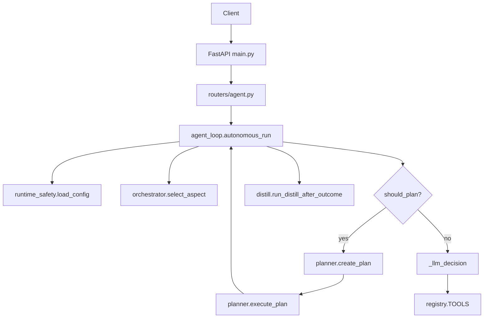

# AI Onboarding — Layla Codebase

This document helps AI agents quickly research and analyze the Layla codebase. Read this first before implementing changes.

---

## Quick orientation

| Document | Purpose |
|----------|---------|
| [AGENTS.md](../AGENTS.md) | Universal AI operations manual: file map, hard rules, code style, how to add tools/aspects |
| [ARCHITECTURE.md](../ARCHITECTURE.md) | One-page request flow, state stores, key files |
| [docs/IMPLEMENTATION_STATUS.md](IMPLEMENTATION_STATUS.md) | Maps North Star §§ to code; verification status |
| [LAYLA_NORTH_STAR.md](../LAYLA_NORTH_STAR.md) | Canonical vision §1–§20. Do not modify unless user asks. |

---

## Architecture map



---

## Integration points table

Where each new subsystem should plug in:

| Subsystem | Entry point | Config key | Dependencies |
|-----------|-------------|------------|--------------|
| Hardware detection | `runtime_safety._probe_hardware()` | (none) | psutil, nvidia-smi |
| Model recommendation | `first_run.recommend_model()` | (derived) | — |
| Model manager | (new) | `models_dir` | huggingface_hub |
| Skills | `planner.create_plan()` tools hint | `skills_enabled` | — |
| Plugins | `main.py` lifespan | `plugins_dir` | — |
| Memory distillation | `distill.run_distill_after_outcome()` | (existing) | sentence-transformers |
| Agent roles | `planner.py`, `agent_loop` intent | `planning_enabled` | — |
| Benchmark | `llm_gateway` post-load | `benchmark_on_load` | — |

---

## Existing vs missing (Sovereign Platform Blueprint)

| Blueprint section | Exists | Location | Gap |
|-------------------|--------|----------|-----|
| 1. Hardware detection | Partial | `runtime_safety._probe_hardware()`, `first_run.detect_*()` | No CPU cores, Metal/ROCm, disk speed, machine tier |
| 2. Model recommendation | Yes | `first_run.recommend_model()` | Not a reusable service; no model metadata DB |
| 3. Model manager | Partial | `first_run` download + `_MODELS_CATALOG` | No `~/.layla/models/`, no list/benchmark/switch |
| 4. Skills layer | No | — | No `agent/skills/` or skill definitions |
| 5. Plugin system | No | — | No `plugins/` or plugin.yaml |
| 6. Memory distillation | Yes | `layla/memory/distill.py` | Jaccard-based; no sentence embeddings, clustering, distilled rules |
| 7. Agent roles | Partial | `planner.py`, aspects | Planner exists; no researcher/debugger/memory curator roles |
| 8. Benchmark | No | — | No tokens/sec on first load |
| 9. Hardware-aware startup | Yes | `first_run.run()` | Not integrated into server lifespan |
| 10. Documentation | Partial | docs/* | No plugins.md |

---

## File map (critical files)

| File | Purpose |
|------|---------|
| `agent/main.py` | FastAPI app, lifespan, routes, scheduler, mission worker |
| `agent/agent_loop.py` | `autonomous_run()`, decision loop, tool dispatch, streaming |
| `agent/orchestrator.py` | Aspect selection, deliberation, decision bias |
| `agent/runtime_safety.py` | Config load (TTL-cached), hardware probe, sandbox |
| `agent/first_run.py` | Hardware wizard, model recommendation, config builder |
| `agent/services/planner.py` | `should_plan`, `create_plan`, `execute_plan` |
| `agent/services/llm_gateway.py` | `run_completion()`, model loading, prewarm |
| `agent/services/mission_manager.py` | Mission create/run, `execute_next_step` |
| `agent/layla/tools/registry.py` | All tools + TOOLS dict |
| `agent/layla/memory/db.py` | SQLite schema, migrate(), DB access |
| `agent/layla/memory/distill.py` | `memory_distill`, `run_distill_after_outcome` |
| `agent/layla/memory/vector_store.py` | ChromaDB, BM25, reranking, HyDE |
| `agent/routers/agent.py` | POST /agent, POST /learn/ |
| `agent/routers/research.py` | Research mission endpoints |
| `personalities/*.json` | Aspect definitions (loaded dynamically) |

---

## Testing checklist

```bash
cd agent
pytest tests/ -x -q
```

Key test files:

- `test_agent_loop.py` — Agent loop, tool dispatch
- `test_north_star.py` — North Star features
- `test_approval_flow.py` — Approval gate
- `test_sandbox.py` — Sandbox validation

---

## Autonomous improvement

For self-improvement workflows, see [docs/AUTONOMOUS_IMPROVEMENT_PROMPT.md](AUTONOMOUS_IMPROVEMENT_PROMPT.md).
