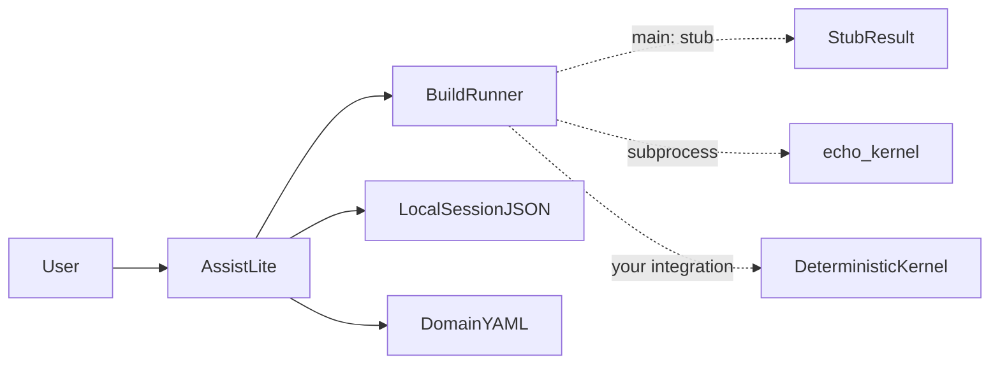

# Fabrication assist layer (infrastructure)

**Separation of roles**

- **Assist** — interaction, variant exploration, comparison framing, explanation, local session memory. It does **not** replace a qualified manufacturing or design-of-record process.
- **Deterministic kernel** — your own evaluator (internal pipeline, solver, vendor tool, subprocess, HTTP service, etc.). Truth for scores/feasibility lives **behind** a narrow adapter.

On **`main`**, this repo ships **infrastructure only**: typed protocol (Pydantic schemas in `fabrication_assist/assist/schemas.py`), session JSON with load safety, heuristic variants, markdown summaries, **`StubRunner`**, and a **real subprocess path** via **`SubprocessJsonRunner`** + **`python -m fabrication_assist.assist.echo_kernel`** for tests and demos. No mandatory coupling to the FastAPI agent loop.

## Architecture



| Module | Role |
|--------|------|
| [`fabrication_assist/assist/layla_lite.py`](../fabrication_assist/assist/layla_lite.py) | `assist()`, `parse_intent()` — validates intent/variants/results |
| [`fabrication_assist/assist/runner.py`](../fabrication_assist/assist/runner.py) | `BuildRunner`, `StubRunner`, `SubprocessJsonRunner` (sets child `PYTHONPATH` to repo root) |
| [`fabrication_assist/assist/echo_kernel.py`](../fabrication_assist/assist/echo_kernel.py) | JSON config in → deterministic `ProductResult` JSON line out |
| [`fabrication_assist/assist/schemas.py`](../fabrication_assist/assist/schemas.py) | `IntentModel`, `VariantConfigModel`, `ProductResultModel`, `HistoryEntryModel` |
| [`fabrication_assist/assist/session.py`](../fabrication_assist/assist/session.py) | Size/depth limits; corrupt JSON raises (no silent empty session) |
| [`fabrication_assist/assist/errors.py`](../fabrication_assist/assist/errors.py) | `AssistError`, `InputValidationError`, `RunnerError`, `SchemaValidationError`, `SessionIOError` |

Domain framing for RAG: [fabrication-assist-layer.md](../knowledge/fabrication-assist-layer.md).

## CLI (no FastAPI)

From repo root, either install the repo editable (`pip install -e .`) or set `PYTHONPATH` to the repo root.

```bash
python -m fabrication_assist.assist "CNC bracket, minimize machining time"
python -m fabrication_assist.assist --runner subprocess "CNC bracket"
python -m fabrication_assist.assist --dry-run "enclosure"
python -m fabrication_assist.assist --explain "enclosure"
python -m fabrication_assist.assist --json --dry-run "test"
python -m fabrication_assist.assist -v --debug --runner subprocess "test"
```

### Exit codes

| Code | Meaning |
|------|--------|
| 0 | Success |
| 1 | Usage / empty message |
| 2 | Input validation (e.g. message too long) |
| 3 | Runner / unexpected failure |
| 4 | Schema validation |
| 5 | Session / IO (corrupt session file, oversize, write error) |

With **`--json`**, failures still print a JSON object with `"ok": false` and error fields to stdout (stderr has the human message).

### Logging

- **`-v` / `--verbose`** — root logger INFO for namespace `fabrication_assist`.
- **`--debug`** — DEBUG (includes subprocess command/return hints in runner).

## Schemas

- **Intent** — `raw` (max length `MAX_USER_TEXT_CHARS` in `schemas.py`), `goal`, `strategies`.
- **Variant config** — required `id`, `label`; optional joinery/material fields; extra keys ignored.
- **Product result** — required `variant_id`, `label`, `score`, `metrics` dict, `feasible`, `notes`; extra keys forbidden.

## Session safety

- Session file is **metadata only**: loaded `preferences` / stale `variants` are **never** passed to `propose_variants()` or `run_build()`.
- Oversize or invalid JSON on load raises **`SessionIOError`** (CLI exit **5**).

## `assist()` behavior

- **`dry_run=True`**: intent + validated variants only; no kernel; **no session write**.
- **`continue_on_runner_error=False`** (default): first runner exception or invalid kernel output aborts with **`RunnerError`** or **`SchemaValidationError`**.
- **`continue_on_runner_error=True`**: failed variants become `feasible: false` rows with notes; **`errors`** list in the returned dict.

## Echo kernel (tests / reference)

`python -m fabrication_assist.assist.echo_kernel <config.json>` prints one JSON line.

| Env | Effect |
|-----|--------|
| `ECHO_KERNEL_FAIL=1` | exit 2 |
| `ECHO_KERNEL_BAD_JSON=1` | invalid stdout (tests schema path) |
| `ECHO_KERNEL_SLEEP=<seconds>` | delay (timeout tests) |

## Extension: LLM intent parsing

You may call **`POST /agent`** with a fixed prompt to map free text → intent JSON. **`main`** uses keyword mapping only (`parse_intent` in `layla_lite.py`).

## Integration checklist (when you add a real kernel)

- [ ] Implement a class that satisfies **`BuildRunner`** (`run_build(config) -> dict`).
- [ ] Optional config flag (e.g. `fabrication_assist_enabled`), default **false**.
- [ ] Optional thin tool in `agent/layla/tools/registry.py` (gated by config + approval as usual).
- [ ] Optional HTTP route behind the same flag.
- [ ] Keep **`fabrication_assist`** off the default `uvicorn` import path until explicitly enabled (startup cost + coupling).

## Packaging

`pyproject.toml` includes **`fabrication_assist*`** alongside agent packages so **`pip install -e .`** from the repo root imports `fabrication_assist` without manually setting `PYTHONPATH`.

## Tests

```bash
cd agent && pytest tests/test_fabrication_assist*.py -q
```

## See also

- [fabrication-assist-layer.md](../knowledge/fabrication-assist-layer.md) (RAG / operator knowledge)
- [fabrication_assist/README.md](../fabrication_assist/README.md)
- [AGENTS.md](../AGENTS.md) — repository map
