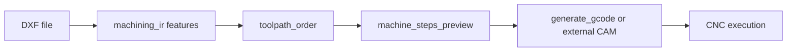

# Fabrication IR and toolchain (North Star alignment)

This document states what Layla **does** model for geometry-to-fabrication handoff versus what remains **operator / CAM** responsibility.

## Intended chain (conceptual)

## Implemented today

| Stage | Code | Notes |
|-------|------|--------|
| Geometry authoring / export | `layla.geometry` programs, `ezdxf` backend | Structured ops, sandboxed execution |
| **IR extraction** | `layla.geometry.machining_ir` | Deterministic: circles → holes, polylines → contours/open paths, lines/arcs as segments |
| **Ordering** | `plan_toolpath_order` | Holes by radius, then closed contours by perimeter; no collision-aware nesting |
| **Coarse steps** | `build_machine_steps_preview` | Labels like `drill_or_pocket_circle`, `profile_cut_2d` — not tool-specific G-code |
| 2D polyline G-code | `generate_gcode` in `layla.tools.registry` | Flat cuts; layer filter; no pocket ramping |
| External bridge | `geometry_external_bridge_url` | Optional operator-hosted CAD |

**Tool:** `geometry_extract_machining_ir(dxf_path)` — read-only IR JSON for the agent and UI.

## Not modeled (by design in this layer)

- Stock size, fixturing, work coordinate systems (beyond what the operator encodes in DXF)
- Tool diameter, corner radius, stepdown, ramp, lead-in/out, feeds/speeds
- 3D CAM, rest machining, adaptive clearing
- Post-processor / machine-specific G-code dialect guarantees

Treat `machine_steps_preview` as **planning input** for a human or external CAM, not a safe file for unsupervised machine motion.

## Machine readiness labels (tool outputs)

Tools attach deterministic validation metadata:

| Value | Meaning |
|-------|---------|
| `interpretive_preview` | Structural checks passed — still **NOT** machine-ready |
| `not_validated` | Failed cheap checks or missing data |
| `needs_cam` | Conceptual — use external CAM / simulation before motion |

`validate_fabrication_bundle` runs IR and/or G-code structural checks only (no physics). Outputs include `disclaimer` and must not be presented as collision-safe or production G-code without operator verification.

## Related docs

- [GEOMETRY_MODULE_SECOND_SWEEP.md](GEOMETRY_MODULE_SECOND_SWEEP.md) — geometry subsystem depth
- [FABRICATION_ASSIST.md](FABRICATION_ASSIST.md) — assist vs deterministic kernel boundary
- [IMPLEMENTATION_STATUS.md](IMPLEMENTATION_STATUS.md) — North Star row mapping
