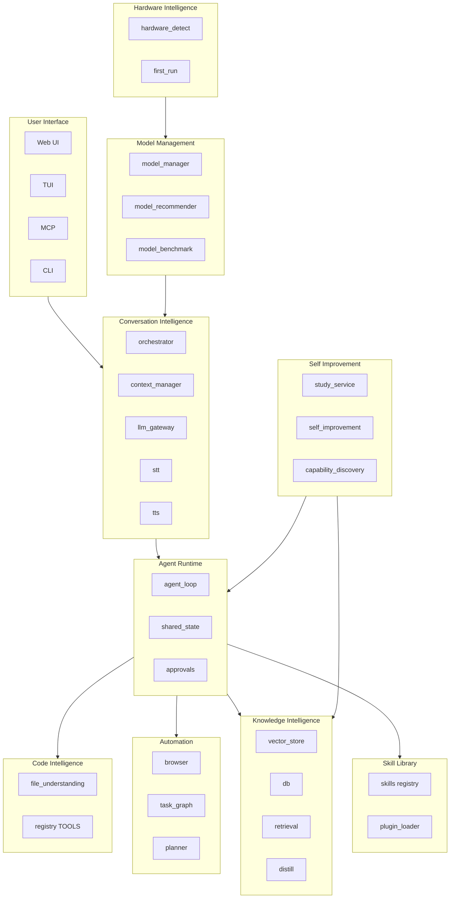

# Layla Prebuilt Platform — Fully Integrated Local AI Companion

This document defines Layla's long-term architecture as a **fully prebuilt local AI companion platform**. All major capabilities ship integrated rather than requiring optional plugins or external setup. See [AGENTS.md](../AGENTS.md), [ARCHITECTURE.md](../ARCHITECTURE.md), [docs/IMPLEMENTATION_STATUS.md](IMPLEMENTATION_STATUS.md), and [LAYLA_NORTH_STAR.md](../LAYLA_NORTH_STAR.md) for related context.

---

## Prebuilt Platform Principles

1. **Integrated capabilities over optional plugins** — Core features (conversation, knowledge, code, automation, model management, agent runtime, skills, hardware, self-improvement, UI) ship in the main install. Plugins extend; they do not replace core functionality.

2. **Minimal setup** — One install script (`INSTALL.bat` / `install.sh`), hardware wizard (`first_run.py`), model download (MODELS.md). User should not manually install large numbers of plugins to get a working companion.

3. **Human usability** — Clear Web UI (`/ui`), approval flow, aspect selection, voice I/O, TUI, CLI. Design for operators and everyday users, not just developers.

4. **Hardware-aware defaults** — Model recommender, `n_ctx`, `n_gpu_layers`, acceleration backend. `first_run.py` and `runtime_safety._probe_hardware()` derive defaults from detected CPU, RAM, GPU, VRAM.

5. **Open-source first** — Prefer chromadb, sentence-transformers, playwright, faster-whisper, kokoro-onnx, trafilatura, etc. Avoid reinventing; integrate proven OSS.

6. **Local performance** — Optimize for local inference (llama-cpp-python), local vector search (ChromaDB), local embeddings (nomic-embed-text). Remote APIs are opt-in.

---

## Capability Domains

The platform is organized into 10 capability domains. Each domain has a purpose, existing modules, open-source foundations, and future improvements.

---

## 1. Conversation Intelligence

**Purpose:** Multi-aspect dialogue, context management, voice I/O, and LLM orchestration. Enables Layla to hold coherent, context-aware conversations across six personality aspects with optional speech input/output.

**Existing modules:**

| Module | Path | Role |
|--------|------|------|
| orchestrator | `agent/orchestrator.py` | Aspect selection (keyword triggers), deliberation prompt builder, `_load_aspects()` from `personalities/*.json` |
| context_manager | `agent/services/context_manager.py` | Token budgets, prompt assembly, deduplication, conversation summarization at ~75% context |
| llm_gateway | `agent/services/llm_gateway.py` | `run_completion()`, prewarm, auto-thread detection, llama-cpp or remote OpenAI-compatible |
| stt | `agent/services/stt.py` | `transcribe_bytes()`, faster-whisper (CPU/CUDA) |
| tts | `agent/services/tts.py` | `speak_to_bytes()`, kokoro-onnx, pyttsx3 fallback |

**Open-source foundations:** FastAPI, llama-cpp-python, faster-whisper, kokoro-onnx, soundfile

**Future improvements:**

- **instructor** — Grammar-constrained JSON for tool calls; significantly improves parse reliability
- **tiktoken** — Accurate token counting for context budgeting (optional, ~100 MB)
- **vLLM / Ollama adapters** — Support vLLM and Ollama as alternative LLM backends (both open-source, widely used)
- **sumy** — Extractive summarization for long conversations (lightweight, no LLM)

---

## 2. Knowledge Intelligence

**Purpose:** RAG, semantic search, learnings persistence, knowledge base indexing. Powers automatic retrieval in every response and long-term memory.

**Existing modules:**

| Module | Path | Role |
|--------|------|------|
| vector_store | `agent/layla/memory/vector_store.py` | ChromaDB, BM25 hybrid, cross-encoder rerank, HyDE, parent-doc retrieval, confidence+recency boost |
| db | `agent/layla/memory/db.py` | SQLite schema, migrate(), learnings, study_plans, FTS5 virtual table |
| retrieval | `agent/services/retrieval.py` | Retrieval orchestration |
| retrieval_cache | `agent/services/retrieval_cache.py` | Disk-backed retrieval cache (diskcache) |
| distill | `agent/layla/memory/distill.py` | Jaccard + optional semantic clustering, `distill_rules()` |
| workspace_index | `agent/services/workspace_index.py` | Workspace file indexing for semantic search |

**Open-source foundations:** chromadb, sentence-transformers (nomic-embed-text, all-MiniLM fallback), rank-bm25, langchain-text-splitters, diskcache

**Future improvements:**

- **faiss-cpu** — Already in capability registry; promote to core for faster ANN when ChromaDB is bottleneck
- **qdrant-client** — Already in capability registry; support local/remote Qdrant
- **BGE / E5 embeddings** — sentence-transformers alternatives (BAAI/bge-base-en-v1.5, intfloat/e5-base) for quality/performance tradeoffs
- **Knowledge graph** — networkx + structured entities for graph-based retrieval (we already use networkx in memory_graph.py)

---

## 3. Code Intelligence

**Purpose:** Code understanding, workspace mapping, file intent inference. Enables Layla to reason about codebases, file formats, and project structure.

**Existing modules:**

| Module | Path | Role |
|--------|------|------|
| file_understanding | `agent/layla/file_understanding.py` | `analyze_file()`, `get_supported_extensions()` — geometry, fabrication, programming, docs, visual |
| registry (tools) | `agent/layla/tools/registry.py` | python_ast, grep_code, glob_files, diff_files, regex_test, understand_file, workspace_map, project_discovery, code_metrics, code_lint, git_blame, dependency_graph |

**Open-source foundations:** stdlib ast, networkx, unidiff, PyMuPDF, pypdf, python-docx, openpyxl, bandit

**Future improvements:**

- **tree-sitter** — Multi-language AST (Python, JS, TS, Go, Rust, etc.); optional, heavy install
- **jedi** — Python jump-to-definition, completions; lightweight
- **semgrep** — Security-focused static analysis; rules-based, no ML
- **ruff** — Fast Python linter; already used in some tooling; promote for code_lint

---

## 4. Automation

**Purpose:** Browser automation, shell execution, scheduling, research pipeline. Enables Layla to interact with the web, run commands, and execute multi-step research missions.

**Existing modules:**

| Module | Path | Role |
|--------|------|------|
| browser | `agent/services/browser.py` | Playwright: navigate, search, screenshot, click, fill |
| task_graph | `agent/services/task_graph.py` | TaskGraph, GraphExecutor — dependency-ordered execution |
| planner | `agent/services/planner.py` | create_plan(), execute_plan(), role hints (researcher, debugger, memory_curator) |
| research_stages | `agent/research_stages.py` | Research mission pipeline: mapping → investigation → verification → distillation → synthesis |
| registry (tools) | `agent/layla/tools/registry.py` | shell, run_python, schedule_task, list_scheduled_tasks, cancel_task, crawl_site |

**Open-source foundations:** playwright, apscheduler, trafilatura, beautifulsoup4, duckduckgo-search, httpx, requests

**Future improvements:**

- **crawl4ai** — Async web crawler; more powerful than trafilatura for complex sites
- **docker** SDK — docker_run, docker_ps for container automation
- **pyperclip** — clipboard_get, clipboard_set for copy/paste workflows
- **imaplib** — read_email for inbox integration (stdlib)

---

## 5. Model Management

**Purpose:** LLM loading, hardware-aware model selection, install, benchmark. Ensures Layla runs optimally on the user's hardware.

**Existing modules:**

| Module | Path | Role |
|--------|------|------|
| llm_gateway | `agent/services/llm_gateway.py` | Load GGUF via llama-cpp-python or remote OpenAI-compatible |
| model_manager | `agent/services/model_manager.py` | list_models, install_model, benchmark_model, select_best_model |
| model_recommender | `agent/services/model_recommender.py` | Rule-based model size/quantization from hardware |
| model_benchmark | `agent/services/model_benchmark.py` | Tokens/sec on load when benchmark_on_load |
| model_router | `agent/services/model_router.py` | Task-based model selection |

**Open-source foundations:** llama-cpp-python

**Future improvements:**

- **vLLM adapter** — vLLM is widely used for local inference; add as backend option
- **Ollama adapter** — Ollama is popular for local models; add as backend option
- **gguf tooling** — Quantization, conversion; leverage existing ecosystem
- **Model A/B comparison** — Benchmark framework for comparing models on same hardware

---

## 6. Agent Runtime

**Purpose:** Decision loop, approval gate, tool dispatch, mission execution. The core agent loop that orchestrates tool use and reasoning.

**Existing modules:**

| Module | Path | Role |
|--------|------|------|
| agent_loop | `agent/agent_loop.py` | autonomous_run(), decision loop, tool dispatch, streaming, self-reflection |
| shared_state | `agent/shared_state.py` | history deque, pending approvals, touch_activity, audit |
| decision_schema | `agent/decision_schema.py` | Pydantic parse_decision() |
| mission_manager | `agent/services/mission_manager.py` | Multi-step mission execution |
| routers | `agent/routers/agent.py`, `approvals.py`, `study.py`, `research.py`, `memory.py` | HTTP endpoints |

**Open-source foundations:** FastAPI, pydantic, tenacity (retry in llm_gateway)

**Future improvements:**

- **OpenTelemetry** — Structured tracing for agent runs; vendor-neutral
- **diskcache** — Extend retrieval_cache pattern for tool result caching
- **Observability** — observability.py exists; expand log_agent_started, trace_last_run

---

## 7. Skill Library

**Purpose:** Named workflows, plugin loading, planner hints. Enables Layla to prefer high-level skills over raw tools when task matches.

**Existing modules:**

| Module | Path | Role |
|--------|------|------|
| skills registry | `agent/layla/skills/registry.py` | analyze_repo, research_topic, write_python_module, debug_code, document_codebase |
| plugin_loader | `agent/services/plugin_loader.py` | Load plugins from `plugins/*/plugin.yaml` |
| planner | `agent/services/planner.py` | get_skills_prompt_hint() injected when skills_enabled |

**Open-source foundations:** PyYAML

**Future improvements:**

- **DAG composition** — task_graph.py supports dependencies; compose skills as DAG
- **Skill metrics** — Track skill usage and success rates (extend audit)
- **Dynamic skill discovery** — Plugin loader already discovers; expose skill discovery API

---

## 8. Hardware Intelligence

**Purpose:** CPU/RAM/GPU detection, machine tier, first-run wizard. Ensures Layla configures itself for the user's hardware.

**Existing modules:**

| Module | Path | Role |
|--------|------|------|
| hardware_detect | `agent/services/hardware_detect.py` | CPU cores, RAM, GPU name, VRAM, CUDA/ROCm/Metal, machine tier |
| first_run | `agent/first_run.py` | Hardware wizard, writes runtime_config.json |
| runtime_safety | `agent/runtime_safety.py` | _probe_hardware(), hardware-derived defaults for n_ctx, n_gpu_layers |

**Open-source foundations:** psutil, subprocess (nvidia-smi, rocm-smi)

**Future improvements:**

- **Metal detection** — hardware_detect already handles Darwin; refine Apple Silicon detection
- **Disk benchmark** — _probe_disk_speed exists; expose in first_run for storage tier
- **Thermal** — psutil.sensors_temperatures() when available (Linux)

---

## 9. Self Improvement

**Purpose:** Study plans, capability discovery, benchmarking, memory distillation. Enables Layla to grow, discover new capabilities, and improve over time.

**Existing modules:**

| Module | Path | Role |
|--------|------|------|
| study_service | `agent/services/study_service.py` | Autonomous study plan execution |
| self_improvement | `agent/services/self_improvement.py` | evaluate_capabilities(), detect_missing_capabilities(), propose_capability_integrations(), propose_improvements() |
| capability_discovery | `agent/services/capability_discovery.py` | Scan PyPI, GitHub, HuggingFace for candidate libraries |
| benchmark_suite | `agent/services/benchmark_suite.py` | Latency, throughput, memory benchmarks; stores in capability_implementations |
| sandbox_validator | `agent/services/sandbox_validator.py` | Import check + benchmark before enabling capability |
| performance_monitor | `agent/services/performance_monitor.py` | Tool latency, retrieval latency, token throughput |
| distill | `agent/layla/memory/distill.py` | Jaccard + semantic clustering, distill_rules() |
| graph_learning | `agent/services/graph_learning.py` | Graph expansion from learnings |
| capabilities registry | `agent/capabilities/registry.py` | vector_search, embedding, reranker, web_scraper with multiple impls |

**Open-source foundations:** networkx

**Future improvements:**

- **Auto-discovery validation** — capability_discovery + sandbox_validator; run on schedule or first-run
- **RL feedback loop** — usefulness_score, learning_quality_score exist; extend for reinforcement
- **Capability benchmarking on install** — Run benchmark_suite during first_run for default impls

---

## 10. User Interface

**Purpose:** Web UI, TUI, MCP, CLI. Multiple interfaces for different user preferences.

**Existing modules:**

| Module | Path | Role |
|--------|------|------|
| Web UI | `agent/ui/index.html` | Standalone SPA, served at /ui; aspect selection, chat, approvals, study, memory, research, help |
| TUI | `agent/tui.py` | Textual-based terminal UI |
| MCP | `cursor-layla-mcp/server.py` | chat_with_layla, add_learning, start_study_session, approve_action, etc. |
| CLI | `layla.py` | wakeup, ask, study, plans, approve, export, pending, tui |

**Open-source foundations:** textual, FastAPI, highlight.js (CDN), Google Fonts

**Future improvements:**

- **WebSocket** — Live status updates (tool progress, streaming) without polling
- **Theme toggle** — CSS variables already support theming; add dark/light toggle
- **Service worker** — Offline mode for cached UI
- **Progressive Web App** — manifest.json for installable UI

---

## Capability Domain Flow

---

## Related Documents

- [AGENTS.md](../AGENTS.md) — AI operations manual, hard rules, repo map
- [ARCHITECTURE.md](../ARCHITECTURE.md) — Request flow, state locations
- [docs/IMPLEMENTATION_STATUS.md](IMPLEMENTATION_STATUS.md) — North Star mapping, prebuilt domains table
- [LAYLA_NORTH_STAR.md](../LAYLA_NORTH_STAR.md) — Canonical vision
- [knowledge/layla-capabilities-map.md](../knowledge/layla-capabilities-map.md) — 109 tools inventory
- [docs/CAPABILITIES.md](CAPABILITIES.md) — Capability registry, discovery, benchmark
- [docs/TECH_STACK_AND_CAPABILITIES.md](TECH_STACK_AND_CAPABILITIES.md) — Tech stack reference
